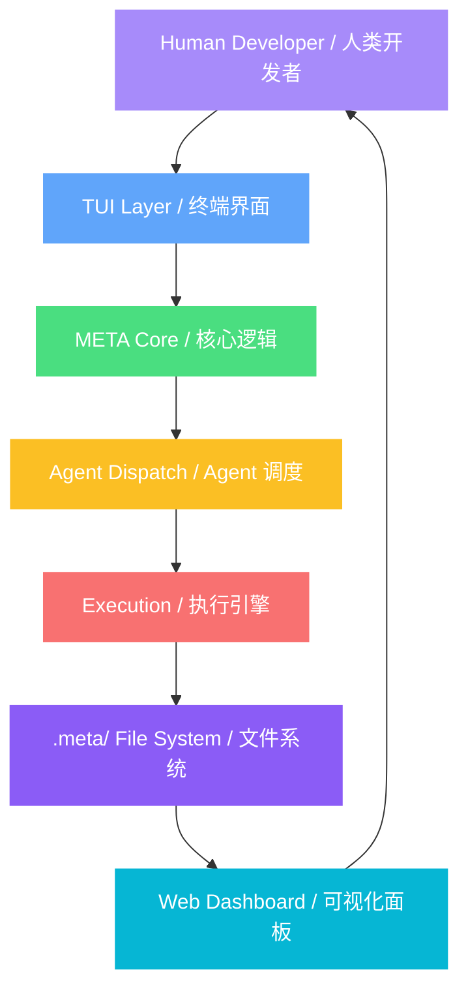

# Eternity Code

**MetaDesign-Driven Autonomous Software Engineering System**

**MetaDesign 驱动的自主软件工程系统**

---

## What is Eternity Code? / 什么是 Eternity Code？

Eternity Code is an **autonomous software engineering system** driven by the **MetaDesign** methodology. It is not merely a code generation tool — it is an intelligent development partner capable of independent analysis, decision-making, execution, and optimization.

Eternity Code 是一个**自主软件工程系统**，通过 **MetaDesign** 方法论驱动完整的开发循环。它不仅仅是代码生成工具，而是一个能够自主分析、决策、执行和优化的智能开发伙伴。

### Core Philosophy / 核心理念

```
Humans define "what" → System decides "how" → Auto-execute → Evaluate → Optimize
人类定义"要什么" → 系统自主决定"怎么做" → 自动执行 → 评估 → 优化
```

---

## Architecture Overview / 架构概览



### 7-Layer Architecture / 7 层架构

| Layer / 层级 | Component / 组件 | Responsibility / 职责 |
|---|---|---|
| **Human Layer** / 人类层 | Human Developer / 人类开发者 | Define meta-requirements, approve decision cards, review blueprints / 定义元需求、审批决策卡片、审查蓝图 |
| **TUI Layer** / 终端层 | Terminal UI / 终端界面 | Interactive interface, welcome screen, card panel / 交互界面、欢迎页面、决策卡片面板 |
| **META Core** / 核心层 | Core Logic / 核心逻辑 | Context loading, card generation, blueprint management / 上下文加载、卡片生成、蓝图管理 |
| **Agent Dispatch** / 调度层 | Agent Dispatcher / Agent 调度 | Role assignment, context building, task distribution / 角色分配、上下文构建、任务分发 |
| **Execution** / 执行层 | Execution Engine / 执行引擎 | Plan generation, task execution, sprint contract negotiation / 计划生成、任务执行、Sprint 合约协商 |
| **File System** / 文件层 | .meta/ Directory / .meta/ 目录 | Persistent storage, state management, logging / 持久化存储、状态管理、日志记录 |
| **Dashboard** / 面板层 | Web Dashboard / Web 面板 | Visual monitoring, historical review, status display / 可视化监控、历史回溯、状态展示 |

---

## MetaDesign Workflow / MetaDesign 工作流

The core of Eternity Code is the **MetaDesign Loop**, an 8-phase cycle:

Eternity Code 的核心是 **MetaDesign 循环**，包含 8 个阶段：

```
┌─────────────────────────────────────────────────────────────┐
│                    MetaDesign Loop / 循环                     │
├─────────────────────────────────────────────────────────────┤
│  ① analyze     → Analyze codebase, generate candidate cards  │
│                  分析代码库，生成候选卡片                       │
│  ② generate    → Generate decision cards                     │
│                  生成决策卡片                                   │
│  ③ decide      → Human reviews and decides (accept/reject)   │
│                  人类审查并决策 (接受/拒绝)                     │
│  ④ plan        → Generate execution plans for accepted cards │
│                  为接受的卡片生成执行计划                       │
│  ⑤ contract    → Sprint contract negotiation                 │
│                  Sprint 合约协商                               │
│  ⑥ execute     → Execute tasks in order, each commits to git │
│                  按任务顺序执行，每个任务独立 git commit         │
│  ⑦ evaluate    → Evaluate execution results                  │
│                  评估执行结果                                   │
│  ⑧ close       → Close loop, write logs and insights         │
│                  关闭循环，写入日志和洞察                       │
└─────────────────────────────────────────────────────────────┘
```

### Command System / 命令系统

| Command / 命令 | Function / 功能 | When to Use / 使用场景 |
|---|---|---|
| `/meta-init` | Initialize MetaDesign / 初始化 MetaDesign | First use on a new project / 新项目首次使用 |
| `/meta` | Generate decision cards / 生成决策卡片 | Start a new loop / 开始新的循环 |
| `/meta-decide` | Review pending cards / 审查待处理卡片 | When pending cards exist / 有 pending 卡片时 |
| `/meta-execute` | Execute accepted cards / 执行已接受卡片 | After decisions / 决策完成后 |
| `/meta-eval` | Evaluate results / 评估执行结果 | After execution / 执行完成后 |
| `/meta-optimize` | Optimize search strategy / 优化搜索策略 | After multiple loops / 多次循环后 |
| `/meta-restructure` | Trigger global restructuring / 触发全局重构 | Quality thresholds breached / 质量阈值触发 |

---

## Dual-Speed Cognitive System / 双速认知系统

Eternity Code employs a **dual-speed architecture** that combines the strengths of different models:

Eternity Code 采用**双速系统**架构，结合不同模型的优势：

### System One: Externalized Cognition / 系统一：外化认知层

```
Dialogue (raw, noisy) / 对话（原始，高噪音）
  → Insights (distilled, structured) / insights（提炼，结构化）
    → Blueprints (intent, executable) / blueprints（意图，可执行）
      → Logs (immutable facts) / logs（事实，不可变）
        → Input for next agent loop / 下一轮 agent 的输入
```

### System Two: Dual-Speed Development / 系统二：双速开发

| Model / 模型 | Role / 角色 | Responsibility / 职责 |
|---|---|---|
| **Weak Model** / 弱模型 (mimo-v2-pro-free) | Daily iteration / 日常迭代 | High-frequency iteration, incremental changes, execute blueprints / 高频迭代、增量修改、执行蓝图 |
| **SOTA Model** / SOTA 模型 (gpt-5.4) | Low-frequency refactoring / 低频重构 | Complete rewrites, update blueprints, eliminate tech debt / 完全重写、更新蓝图、消除技术债 |

**Trigger Conditions / 触发条件**: Automatically triggered by quality monitoring or weekly scheduled:

质量监测自动触发或每周定时触发：

```yaml
sota_trigger:
  schedule: "weekly"
  quality_thresholds:
    - metric: "tech_debt_density"
      threshold: "> 3 items per loop"
    - metric: "rollback_rate"
      threshold: "> 30%"
```

---

## Agent Dispatch System / Agent 调度系统

Eternity Code includes multiple specialized agent roles:

Eternity Code 内置多种专业 Agent 角色：

| Agent / Agent 角色 | Responsibility / 职责 |
|---|---|
| **card-reviewer** | 4D Rubric scoring (req_alignment, neg_conflict, cost_honesty, feasibility) / Rubric 四维评分 |
| **coverage-assessor** | REQ coverage assessment / REQ 覆盖度评估 |
| **planner** | Card → Execution plan decomposition / 卡片 → 执行计划分解 |
| **task-executor** | Single task execution with fresh context / 单任务执行（独立上下文） |
| **eval-scorer** | Real measurement via bash commands / 真实 bash 命令测量 |
| **contract-drafter** | Draft verifiable completion criteria / 草拟可验证的完成标准 |
| **contract-validator** | Validate criteria objectivity / 验证标准客观性 |
| **prediction-auditor** | Compare predicted vs actual results / 对比预测与实际结果 |
| **insight-writer** | Extract design insights / 提取设计洞察 |
| **restructure-planner** | Global code quality diagnosis (SOTA) / 全局代码质量诊断 |

### Watchdog Safety Mechanism / Watchdog 安全机制

- **RepetitionDetector** / 重复检测: Tool call hashing, hallucination loop detection / 工具调用哈希，幻觉循环检测
- **CircuitBreaker** / 熔断器: Per-role independent fuse, closed/open/half-open state machine / per-role 独立熔断，closed/open/half-open 状态机
- **Timeout Protection** / 超时保护: AbortController wraps every call / AbortController 包裹每次调用
- **Rate Limit Handling** / 限流处理: Exponential backoff retry / 指数退避重试

---

## Quick Start / 快速开始

### Launch / 启动

```bash
# Start TUI in current directory
# 在当前目录启动 TUI
eternity-code

# Specify a project directory
# 指定项目目录
eternity-code /path/to/project

# Use --cwd for MetaDesign working directory
# 使用 --cwd 指定 MetaDesign 工作目录
eternity-code --cwd /path/to/project

# Continue the last session
# 继续上次会话
eternity-code --continue

# Attach to a running server
# 连接到运行中的服务器
eternity-code attach http://localhost:4096
```

### Access Dashboard / 访问 Dashboard

Open in browser: http://localhost:7777

浏览器打开：http://localhost:7777

---

## File System / 文件系统

```
.meta/
├── design/                         # Product constraints (human + SOTA write)
│   │                               # 产品约束层（人类 + SOTA 写）
│   ├── design.yaml                 # MetaDesign main file / 元设计主文件
│   └── schema/                     # Schema definitions / Schema 定义
├── cognition/                      # Externalized cognition (SOTA write, weak model read)
│   │                               # 外化认知层（SOTA 写，弱模型读）
│   ├── blueprints/                 # Blueprint files / 蓝图文件
│   └── insights/                   # Insight files / 洞察文件
├── execution/                      # Execution records (weak model write)
│   │                               # 执行记录层（弱模型写）
│   ├── cards/                      # Decision cards / 决策卡片
│   ├── plans/                      # Execution plans / 执行计划
│   ├── loops/                      # Loop records / 循环记录
│   ├── logs/                       # Execution logs / 执行日志
│   ├── agent-tasks/                # Sub-agent call records / Sub-Agent 调用记录
│   └── anomalies/                  # Watchdog anomaly logs / Watchdog 异常日志
└── negatives/                      # Negative space — rejected directions
                                    # 负空间（被拒绝的方向）
```

---

## Project Structure / 项目结构

```
Eternity code/
├── docs/                           # Documentation, reports, designs
│   │                               # 文档、报告、设计稿
├── schema/                         # design/card/loop schema definitions
│   │                               # design/card/loop schema 定义
├── examples/                       # Example MetaDesign configurations
│                                   # 示例 MetaDesign 配置
└── packages/
    └── eternity-code/              # Core MetaDesign system
        │                           # 核心 MetaDesign 系统
        └── src/
            ├── cli/cmd/tui/        # TUI interface components
            │                       # TUI 界面组件
            ├── meta/               # MetaDesign core logic
            │                       # MetaDesign 核心逻辑
            │   ├── agents/         # Agent dispatch (10+ roles)
            │   │                   # Agent 调度（10+ 角色）
            │   ├── execution/      # Execution engine
            │   │                   # 执行引擎
            │   ├── watchdog/       # Anomaly monitoring
            │   │                   # 异常监控
            │   ├── dashboard/      # Web Dashboard server
            │   │                   # Web Dashboard 服务器
            │   └── prompt/         # Prompt optimization
            │                       # Prompt 优化
            ├── session/            # Session & prompt loop
            │                       # 会话与 prompt 主循环
            └── tool/               # Tool system (bash, read, edit, etc.)
                                    # 工具系统
```

---

## Key Features / 核心特性

| Feature / 特性 | Description / 描述 |
|---|---|
| **MetaDesign Driven** / MetaDesign 驱动 | Autonomous analysis, generation, decision, execution, and evaluation / 自主分析、生成、决策、执行、评估 |
| **Dual-Speed System** / 双速系统 | Weak model for daily iteration + SOTA model for low-frequency refactoring / 弱模型日常迭代 + SOTA 模型低频重构 |
| **Agent Dispatch** / Agent 调度 | 10+ specialized agent roles with unified dispatcher / 10+ 专业 Agent 角色，统一调度 |
| **Watchdog Protection** / Watchdog 保护 | Circuit breaker, timeout, hallucination detection / 熔断、超时、幻觉检测 |
| **Web Dashboard** / Web 面板 | Real-time monitoring and historical review / 实时监控和历史回溯 |
| **Git Integration** / Git 集成 | Independent commit per task, fully traceable / 每个任务独立 commit，可追溯 |
| **Negative Space** / 负空间管理 | Record rejected directions to avoid redundant exploration / 记录被拒绝的方向，避免重复探索 |
| **Sprint Contract** / Sprint 合约 | Verifiable completion criteria before task execution / Task 执行前可验证的完成标准 |
| **Acceptance Checklist** / 验收清单 | Auto-verify checklist items via bash commands / 通过 bash 命令自动验证验收项 |
| **Prompt Feedback Loop** / Prompt 反馈环 | N≥5 sample mean quality scoring for prompt optimization / N≥5 样本均值质量评分，优化 Prompt |
| **Workspace Management** / 工作区管理 | Switch directories via `--cwd` or TUI workspace dialog / 通过 `--cwd` 或 TUI 工作区对话框切换目录 |

---

## Documentation / 文档

| Document / 文档 | Description / 描述 |
|---|---|
| [Architecture / 架构](docs/CURRENT_ARCHITECTURE.md) | Current codebase, entry points, module boundaries / 当前代码主链、运行入口、模块边界 |
| [Usage Guide / 使用指南](docs/USAGE_GUIDE.md) | Complete workflow and command reference / 完整工作流和命令说明 |
| [Blueprint / 蓝图](docs/BLUEPRINT.md) | Current state and future roadmap / 当前状态和未来规划 |
| [Project Structure / 项目结构](docs/PROJECT_STRUCTURE.md) | Repository and directory layout / 仓库和目录层级说明 |
| [Two-Speed System / 双速系统](docs/TWO_SPEED_SYSTEM.md) | Dual-speed cognitive architecture / 双速认知架构 |
