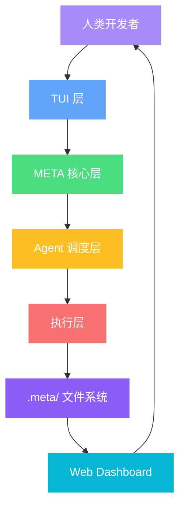

# Eternity Code

<p align="center">
  <a href="https://eternity-code.ai">
    
  </a>
</p>

<p align="center">
  <strong>MetaDesign驱动的自主软件工程系统</strong>
</p>

<p align="center">
  <a href="https://discord.gg/eternity-code"></a>
  <a href="https://www.npmjs.com/package/eternity-code-ai"></a>
  <a href="https://github.com/anomalyco/eternity-code/actions/workflows/publish.yml"></a>
</p>

---

## 什么是 Eternity Code？

Eternity Code 是一个**自主软件工程系统**，通过 **MetaDesign** 方法论驱动完整的开发循环。它不仅仅是代码生成工具，而是一个能够自主分析、决策、执行和优化的智能开发伙伴。

### 核心理念

```
人类定义"要什么" → 系统自主决定"怎么做" → 自动执行 → 评估 → 优化
```

---

## 架构概览



### 7层架构

| 层级 | 组件 | 职责 |
|------|------|------|
| **Human Layer** | 人类开发者 | 定义元需求、审批决策卡片、审查蓝图 |
| **TUI Layer** | 终端界面 | 交互界面、欢迎页面、决策卡片面板 |
| **META Core** | 核心逻辑 | 上下文加载、卡片生成、蓝图管理 |
| **Agent Dispatch** | Agent调度 | 角色分配、上下文构建、任务分发 |
| **Execution** | 执行引擎 | 计划生成、任务执行、合约协商 |
| **File System** | .meta/目录 | 持久化存储、状态管理、日志记录 |
| **Dashboard** | Web界面 | 可视化监控、历史回溯、状态展示 |

---

## MetaDesign 工作流

Eternity Code 的核心是 **MetaDesign 循环**，包含8个阶段：

```
┌─────────────────────────────────────────────────────────────┐
│                    MetaDesign 循环                           │
├─────────────────────────────────────────────────────────────┤
│  ① analyze     → 分析代码库，生成候选卡片                    │
│  ② generate    → 生成决策卡片 (Card)                         │
│  ③ decide      → 人类审查并决策 (accept/reject)              │
│  ④ plan        → 为接受的卡片生成执行计划                    │
│  ⑤ contract    → Sprint 合约协商                            │
│  ⑥ execute     → 按任务顺序执行，每个任务独立 git commit     │
│  ⑦ evaluate    → 评估执行结果                                │
│  ⑧ close       → 关闭循环，写入日志和洞察                    │
└─────────────────────────────────────────────────────────────┘
```

### 命令系统

| 命令 | 功能 | 使用场景 |
|------|------|----------|
| `/meta-init` | 初始化 MetaDesign | 新项目首次使用 |
| `/meta` | 生成决策卡片 | 开始新的循环 |
| `/meta-decide` | 审查待处理卡片 | 有 pending 卡片时 |
| `/meta-execute` | 执行已接受卡片 | 决策完成后 |
| `/meta-eval` | 评估执行结果 | 执行完成后 |
| `/meta-optimize` | 优化搜索策略 | 多次循环后 |

---

## 双速认知系统

Eternity Code 采用**双速系统**架构，结合不同模型的优势：

### 系统一：外化认知层

```
对话（原始，高噪音）
  → insights（提炼，结构化）
    → blueprints（意图，可执行）
      → logs（事实，不可变）
        → 下一轮 agent 的输入
```

### 系统二：双速开发

| 模型 | 角色 | 职责 |
|------|------|------|
| **弱模型** (mimo-v2-pro-free) | 日常迭代 | 高频迭代、增量修改、执行蓝图 |
| **SOTA 模型** (gpt-5.4) | 低频重构 | 完全重写、更新蓝图、消除技术债 |

**触发条件**：质量监测自动触发或每周定时触发

```yaml
sota_trigger:
  schedule: "weekly"
  quality_thresholds:
    - metric: "tech_debt_density"
      threshold: "> 3 items per loop"
    - metric: "rollback_rate"
      threshold: "> 30%"
```

---

## Agent 调度系统

Eternity Code 内置多种专业 Agent 角色：

| Agent | 职责 |
|-------|------|
| **card-reviewer** | Rubric 四维评分 |
| **coverage-assessor** | REQ 覆盖度评估 |
| **planner** | 卡片 → 执行计划 |
| **task-executor** | 单任务执行 |
| **eval-scorer** | 真实测量评估 |
| **contract-drafter/validator** | Sprint 合约协商 |

### Watchdog 安全机制

- **RepetitionDetector**：工具调用哈希，幻觉循环检测
- **CircuitBreaker**：per-role 独立熔断，closed/open/half-open 状态机
- **超时保护**：AbortController 包裹每次调用

---

## 快速开始

### 安装

```bash
# 一键安装
curl -fsSL https://eternity-code.ai/install | bash

# 包管理器
npm i -g eternity-code-ai@latest
brew install anomalyco/tap/eternity-code
```

### 启动

```bash
# Windows
start.bat

# Linux/Mac
./start.sh
```

### 访问 Dashboard

浏览器打开：http://localhost:7777

---

## 文件结构

```
.meta/
├── design/
│   ├── design.yaml              # 元设计主文件
│   └── schema/                  # Schema 定义
├── cognition/
│   ├── blueprints/              # 蓝图文件
│   └── insights/                # 洞察文件
├── execution/
│   ├── cards/                   # 决策卡片
│   ├── plans/                   # 执行计划
│   ├── loops/                   # 循环记录
│   └── logs/                    # 执行日志
└── negatives/                   # 负空间（被拒绝的方向）
```

---

## 项目结构

```
Eternity code/
├── docs/                        # 文档、报告、设计稿
├── schema/                      # design/card/loop schema
├── examples/                    # 示例配置
└── opencode-dev/                # 实际运行工程
    └── packages/
        └── eternity-code/
            └── src/
                ├── cli/cmd/tui/ # TUI 界面组件
                ├── meta/        # MetaDesign 核心逻辑
                ├── agent/       # Agent 调度系统
                ├── execution/   # 执行引擎
                └── dashboard/   # Web Dashboard
```

---

## 文档

- [架构文档](docs/CURRENT_ARCHITECTURE.md) - 当前代码主链、运行入口、模块边界
- [使用指南](docs/USAGE_GUIDE.md) - 完整工作流和命令说明
- [项目蓝图](docs/BLUEPRINT.md) - 当前状态和未来规划
- [项目结构](docs/PROJECT_STRUCTURE.md) - 仓库和目录层级说明

---

## 核心特性

✅ **MetaDesign 驱动** - 自主分析、生成、决策、执行、评估  
✅ **双速系统** - 弱模型日常迭代 + SOTA 模型低频重构  
✅ **Agent 调度** - 多角色专业 Agent 协同工作  
✅ **Watchdog 保护** - 熔断、超时、幻觉检测  
✅ **Web Dashboard** - 实时监控和历史回溯  
✅ **Git 集成** - 每个任务独立 commit，可追溯  
✅ **负空间管理** - 记录被拒绝的方向，避免重复探索  

---

## 贡献

欢迎贡献！请阅读 [贡献指南](Eternity code/docs/CONTRIBUTING.md) 了解详情。

---

## 社区

- [Discord](https://discord.gg/eternity-code)
- [X.com](https://x.com/eternity-code)
- [官网](https://eternity-code.ai)

---

<p align="center">
  <sub>Built with ❤️ by the Eternity Code Team</sub>
</p>